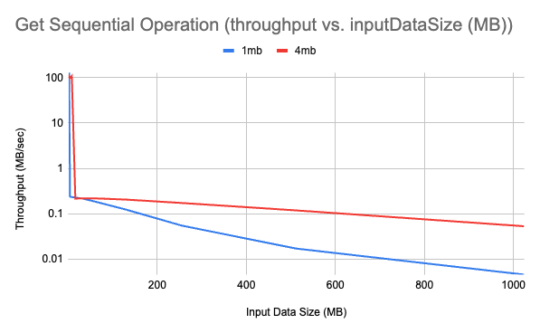
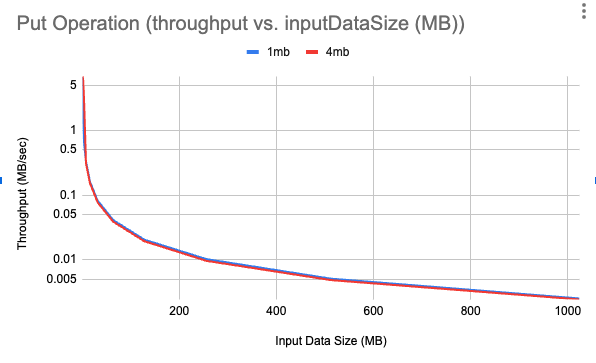
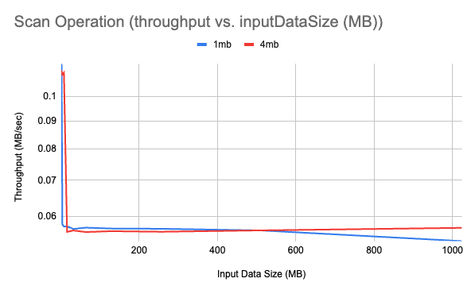
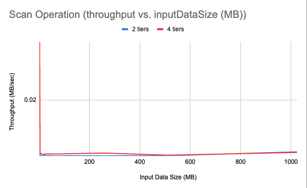

# kvstore

A key-value store implementation for CSC443, Fall 2023 by Kaspar Poland, Janine Newton, and Tianji Zhang.

## Table of Contents

1. Building and installing
2. User Guide
3. Code Architecture / Design Elements
4. Project Status
5. Experiments
6. Testing Strategy
7. References

## 1. Building and installing

See the [BUILDING](BUILDING.md) document.

## 2. User Guide

This library exposes a single class, `KvStore`, meant to be instantiated per-table. The instantiation of the object does nothing, the `Open()` method creates the table. The table is a key-value table. The keys and values are both `uint64_t`. Variable-sized values are not supported (yet).

The methods on `KvStore` are described here in natural language. This is largely duplicated from the header file, read that here: [./src/kvstore.hpp](./src/kvstore.hpp).

### `Open`

```cpp
void Open(std::string& dbname, Options opt);
```

Creates the database. Locks the data directory. Throws the `DatabaseInUseException` if the data directory is opened but already has a lock present in it. Could also throw a `FailedToOpenException`, which often happens when the user opening the database does not have the permissions to create files there.

The `Options` structure can be read about in the header file. Each field is optional, and has a default.

- `dir`: The data directory to create the data files in. If left unspecified, defaults to the current directory the executable is instantiated in, that is, `./`.
- `memory_buffer_elements`: The number of elements to keep in the in-memory Memtable. If not specified, defaults to roughly 1MB worth of elements, being about 131k elements.
- `buffer_pages_initial`: The initial amount of elements to allocate for the buffer pool, in units of 4KB pages.
- `buffer_pages_maximum`: The maximum amount of elements to allocate for the buffer pool, in units of 4KB pages. This maximum is the number of pages that are stored in-memory to prevent going into the filesystem too often.
- `tiers`: The "tiering" constant for the LSM tree. Must be >= 2, and defaults to 2 if not specified. Common values lie between 2 and 10. This LSM tree supports any tiering number >= 2, and is automatically configured to use the Dostoevsky merge policy [1]. See the paper for more details.
- `serialization`: An enum to format data in different ways, either a sorted-string table, or as a BTree in the filesystem. One of `DataFileFormat::kBTree` or `DataFileFormat::kFlatSorted`. Defaults to `DataFileFormat::kBTree`, which generally uses fewer IOs. See the benchmarks for more details.

### `DataDirectory`

```cpp
std::filesystem::path DataDirectory() const;
```

Gets the directory the data is stored in.

### `Close`

```cpp
void Close();
```

Closes the directory. Unlocks the data directory for future tables to use. This method is also called on in the destructor of a `KvStore` object.

### `Get`

```cpp
std::optional<uint64_t> Get(uint64_t key) const;  
```

Gets a single value for a key. Returns `std::nullopt` if the value is not present in the database.

In terms of architecture, the `Get()` call traverses the LSM tree from newest-to-oldest, first visiting the in-memory Memtable, and then visiting younger levels, until it reaches the final level. Each level has Blocked Bloom filters to prevent extraneous IOs into the filesystem, and expected performance is O(1) IOs.

### `Scan`

```cpp
std::vector<std::pair<uint64_t, uint64_t>> Scan(uint64_t lower_bound, uint64_t upper_bound) const;
```

A range query, returns a vector of all of the keys `key` such that `lower_bound <= key <= upper_bound`. Assumes that the vector fits in memory. If the vector does not fit in memory, be sure to batch this with multiple `Scan()` queries.

Scans are expensive, and perform many IOs to retrieve data. Be sure not to Scan too large of a range.

### `Put`

```cpp
void Put(uint64_t key, uint64_t value)
```

Puts a (key, value) pair into the table. The pair is batched into the Memtable, and is flushed into the filesystem when the Memtable has grown to its limit size, specified in the `Options` structure.

Each level in the LSM tree has `Options.tiers` number of runs, and if flushing the Memtable (into level 0) fills a run, the runs of one level L are compacted into a single run in level L+1. This continues until no more compaction is needed. This is an expensive operation, but is amortized of many writes.

Note that all `uint64_t` values of `value` are allowed, EXCEPT the hex value:

```txt
00 db 00 de ead 00 db 00
```

Which is the integer `61643976284887808`. This is because this value (pronounced "db dead db") is the tombstone marker, and is used to mark keys as deleted. We discuss this further in a dedicated document written during development [./docs/tombstone.md](./docs/tombstone.md), and in the next operation, `Delete`.

### `Delete`

```cpp
void Delete(uint64_t key);
```

Deletes a (key, value) pair from the table. To prevent a full scan of the database, a tombstone marker is inserted in place of the value. This tombstone marker will come back from a `Get()` as the key never having been there, but allows the `Delete` operation to avoid a read-before-write.

### Summary

The database is a key-value store with a similar interface as a hashmap, but designed to store much more data. See below for the benchmarks for storing that much data.

The following sections discuss design decisions and implementation details of the table.

## 3. High-level code architecture / Design Elements

The database (used interchangeably with key-value store) is structured as an Log-Structured Merge (LSM) tree. Other components of the project are:

1. In-memory Memtable ([./src/buf.hpp](./src/memtable.hpp)): a red-black tree to buffer incoming write requests.
1. BufferPool ([./src/buf.hpp](./src/memtable.hpp)): a cache for filesystem pages.
1. Clock Eviction Algorithm ([./src/evict.hpp](./src/evict.hpp)): An eviction algorithm for the Buffer pool cache.
1. Blocked Bloom Filter ([./src/filter.hpp](./src/filter.hpp)): an Bloom Filter to optimize read requests.
1. LSM level and LSM run managers ([./src/lsm.hpp](./src/lsm.hpp)): Two classes, one representing a single level, one representing a run.
1. Manifest file manager ([./src/manifest.hpp](./src/manifest.hpp)): Represents the manifest file and its data.

And two Sstable implementations, their interface described in [./src/sstable.hpp](./src/sstable.hpp). The instance variables they are used as are called `sstable_serializer`, but really they do both serialization _and_ deserialization, that is, ser/de.

1. BTree Sstable ser/de ([./src/sstable_btree.cpp]), store the file in BTree format to have log_B search times.
1. Sorted Sstable ser/de ([./src/sstable_naive.cpp]), store the file in a flat sorted way, for binary search.

There are other various utility files that deal with:

1. naming files within the file system ([./src/naming.hpp](./src/naming.hpp)),
1. a minheap implementation for Dostoevsky merging ([./src/minheap.hpp](./src/minheap.hpp)),
1. validating that files have the correct data within them ([./src/fileutil.hpp](./src/fileutil.hpp)),
1. string functions ([./src/dbg.hpp](./src/dbg.hpp)), and
1. a collection of common constants like page size, key size, etc. ([./src/constants.hpp](./src/constants.hpp)).

The entrypoint into the code is the [./src/kvstore.hpp](./src/kvstore.hpp) file, where the main `KvStore` class lives. This is the class that users of the library will instantiate. Like RocksDB (citation needed), the database is only meant to be used as a library, and has no command-line or other interfaces.

The `KvStore` uses `LSMLevel` instances for the LSM levels of the tree, a `ManifestHandle` instance to handle the manifest file, a `BufPool` instance for the buffer pool.

To describe the features of our database, we enumerate some of the design decisions that went into it.

### Blocked Bloom Filters

To improve performance, we used blocked bloom filters over a standard bloom filter. Blocked bloom filters have better cache-locality than standard bloom filters, as they have at most 1 CPU cache miss while fetching. Since bloom filters are frequently accessed, they are often in memory, meaning the saving actually works.

Without a buffer pool, it'd be required to fetch the bloom filter from the filesystem on each read, removing most of the point of the filter itself.

The bloom filters are an interesting implementation. In the [./src/filter.cpp](./src/filter.cpp) file, there is a line:

```cpp
using BloomFilter = std::array<uint8_t, kFilterBytes>
```

That is, the "bloom filter" type is really a custom-implemented bitset with extra bloom logic on top. The original implementation of this class really did use a `std::bitset` to achieve the same goal, but converting these in-memory objects into bytes to be stored on disk (and back again) ate at our performance, so we wrote our own.

The bloom filters are kept as separate files. We talk more about file formats and naming later, but the filter files are named something like:

```txt
some_directory/my-database.FILTER.Lx.Ry.Iz
```

where:

- `some_directory` is the data directory that the user chose to save their data in,
- `my-database` is the unique string name of the database,
- `FILTER` is naturally the type of file to prevent collisions,
- `x` is the _level_ the filter belongs to,
- `y` is the _run_ the filter belongs to, and
- `z` is the _intermediate_ the filter belongs to. The intermediate is just the offset-within-a-run for a file. We talk more about why we chose to have multiple files per level and per run later.

Another interesting bit about the bloom filter is that there is a serializer created per-level. This is to facilitate Monkey, where the bits_per_entry are a function of the level and the number of tiers configured. The serializer will take these numbers into account and instantiate the right number of different hash functions.

They aren't really different, all being xxhash (citation needed) functions with a different starting seed, but it's enough.

### Extendible hashing

The Buffer Pool implementation uses extendible hashing based on a Trie (citation needed) data structure, also sometimes called a prefix tree. That is, the extendible hashing internally tracks the number of relevant bits, and traverses the data structure to get the right page.

The buffer pool implementation works hand-in-hand with the eviction algorithm. They are two different files, and could really be two different libraries. They are split apart for testing, so that extendible hashing growing and shrinking can be tested independently of the eviction algorithm kicking elements out.

The eviction algorithm itself is clock-based, and is generic over its container, just like the buffer pool. That is, it's technically possible to store any structure in the buffer pool, not just pages.

### File sizes

> The original documentation for file sizes is split between [./docs/compaction.md](./docs/compaction.md), the document describing compaction and [./docs/structure.md](./docs/structure.md), the document describing the LSM tree structure. It is distilled for this section here.

One of the most interesting decisions we made in this project was to cap the size of the files. File sizes affect the implementation of compaction, flushing the Memtable, and getting from each file. LevelDB (citation needed) and RocksDB (citation needed) also do this.

The file sizes are capped to be the exact same (data) size of the memtable, meaning the files will contain the exact same number of keys that the Memtable is initialized to have as a maximum.

This makes flushing the Memtable into the filesystem simple. Memtables and SSTs are 1:1 with each other.

It also makes the compaction process easier. Being able to merge the data from two files no longer requires in-memory buffers into each of the files, since both files are assumed to be small enough to fit in memory. However, this offers greater complexity for LSM levels and runs. Now, a single run in an LSM level is not a single file, but rather, multiple files.

The number of tiers-per-level is controlled by the `tiers` option in the `Options` struct, one of the parameters to `KvStore::Open()`. There are some downsides, which we discuss in the next section, LSM structure.

### File formats

A lot of thought went into our file formats. They are described in many different documents that have all been maintained throughout development:

- [`./docs/file.md`](./docs/file.md): describes the metadata that every database file should have
- [`./docs/file_sstable.md`](./docs/file_sstable.md): describes the format of BTree Sstables. There isn't a document for the FlatSorted Sstables, but they follow a similar structure (first page metadata, rest pure data).
- [`./docs/file_filter.md`](./docs/file_filter.md): describes the format of Bloom Filter files.
- [`./docs/file_manifest.md`](./docs/file_manifest.md): Describes the very condensed format of the Manifest file.

### Database structure

> The original documentation for database structure is [./docs/structure.md](./docs/structure.md). This is similar content.

The structure of the LSM level was highly influenced by two things: using Dostoevsky, and our previously described file sizes specification.

As previously mentioned entire LSM tree/database is a single `KvStore` object. There are multiple levels, and each has multiple runs. Due to the decision to have small "pick-up-able" files, there are also many files per run. The hierarchy is then:

```txt
Table (KvStore)
 - Lock file
 - Manifest file
 - LSMLevel
   - LSMRun
     - Data file
     - Filter file
```

The number of levels is dependent purely on the data size. More data -> more levels. However, the number of runs in a single level is fixed by the `Options.tiers` option. The runs never exceeds that, and if it does, compaction is triggered and the entire level is emptied into a single run in the next level.

That is, there is an unbounded amount of levels in the table, a fixed number of runs in a level (T), and an unbounded number of files in a run.

The number of files in a run is a function of the level the run is a part of.

Also, as mentioned briefly in the Bloom filters section, we keep one bloom filter per data file. It was really to promote development speed, as two different people were working on the BTree serialization and Bloom Filter serialization at the same time, and we didn't want to get in each others way.

This sort of structure together with small file sizes means that the database might have thousands of 1-4MB files for a large multi-gigabyte dataset. Supposedly this many files really does slow a system down, but not by much (leveldb citation needed).

### Compaction

> The original documentation written during development for compaction is `./docs/compaction.md`. This is similar content.

Compaction is also affected by using Dostoevsky and the file size decision. Compaction, in theory, is simple: when there are T runs in a file, compaction is triggered. All runs in that level L are merged into a single run in level L+1, which may not exist.

Compaction is done by reading the data from the first file in each T runs. Since the files are small, we assume they fit into memory. Using a process similar to merge-sort, we fill a buffer with the smallest of the keys from each of the T files. We continue this until we generate enough data to fill a file, in which case we flush into a file.

This process continues until there isn't any more data to read out of each run.

Compaction is this simple because of the assumption that an entire file can be read into memory to perform compaction. We also use a MinHeap to optimize the comparisons between the T files. That is, each time we place a key from file `0 <= k <= T`, we insert the next key from file `k` into the MinHeap.

Also to note, each time the buffer is flushed into a new data file, a new BloomFilter is created from those keys. As mentioned before, data files and bloom filters are 1:1.

## 4. Project Status

The project is finished, though there are some caveats.

All features described above work as intended, but there are some things that were planned from the beginning, and never gotten to, or are in an odd state:

1. **Monkey**: it was planned from the beginning. Each `LSMLevel` instance constructs its own `Filter` instance, and the filter instance is parameterized by the tiering amount and the level it's in. The only thing remaining is `R`, the user parameter that would be a part of the implementation. That, and it would need to be tested, validated, etc.
2. **Dostoevsky**: It was also planned from the start since we use tiering, but the time to write the final merge algorithm was never found. We use MinHeap merges for cross-level merging, but the final level uses tiering still.
3. **Deletion of keys**: We planned on implementing Dostoevsky, where the keys would finally be deleted if they are marked with a tombstone. Since this never happened, keys stay as tombstones forever in the final level, and accumulate forever. This doesn't affect the usability of the database, only means the overheads/write amplification is higher.
4. **Full control over parameters**: We planned to add functionality to provide additional control over parameters for
   experimental testing. We have parameters to control memtable size, SST search strategy (binary search vs Btree),
   whether LSM compaction is used, the initial and maximum number of pages in the buffer pool, and the maximum number of
   runs at each level using tiering. We are missing parameters to control the number of bits per entry in the Bloom
   filters, as well as the ability to disable the buffer pool.
I'm sure there are others.

## 5. Experiments

### Stage 1






In stage 1, we performed experiments to measure Put, Get, and Scan performance. At this stage, SSTs are accessed by
binary
search, and we do not use LSM compaction.
In our current implementation, we are unable to remove the buffer pool, so these experiments include the use of a buffer
pool with a capacity for 128 pages.
We did test the effect of a 1MB memtable vs. a 4MB memtable, as shown.
These experiments can be run using the command:

```sh
./build/experiments/stage_1_experiments
```

### Stage 2


In stage 2, we compared random get performance for the original binary search for SSTs vs. the new Btree search. We did
not see a large difference in performance. We expect this is due to an error in our Btree implementation, since Btree
search should be algorithmically faster than binary search. These experiments can be run using
the command:

```sh
./build/experiments/stage_2_experiments
```

### Stage 3




In stage 3, we performed experiments to measure how Put, Get, and Scan performance has changed due to the additional
features we added.
We were not able to test for the effect of the buffer pool, but we expect that it likely improved performance.
There is not much improvement when ```tiers=2```, despite the addition of LSM compaction and Btree search for SSTs.
We do see an improvement in Put performance for ```tiers=4```,
though Get and Scan performance are worse, as might be expected for a higher number of tiers.
These experiments can be run using the command:

```sh
./build/experiments/stage_3_experiments
```

## 6. Testing Strategy

All parts of the project are tested through unit tests. The tests can be ran independently as their own binary, and take somewhere from 10 - 100 seconds to run, depending on the quality of the machine.

The unit tests are all black-box tests of their respective interface. Each source code file was created as its own linkable library, and a test file is for that library especially.

This is a good thing, and allows us to test things like the `BufPool` and `ClockEvictor` independently from any database, giving us higher confidence in their working.

To run the tests, compile and build the project:

```sh
cmake -S . -B build # Initialize build dir
cmake --build build # Compile into binary
./build/tests/kvstore_test
```

This runs all of the tests. We use the GoogleTest library, so the `--gtest_filter` option can be set to select specific tests (citation needd).

## 7. References

[1] [Dostoevsky](https://scholar.harvard.edu/files/stratos/files/dostoevskykv.pdf)
